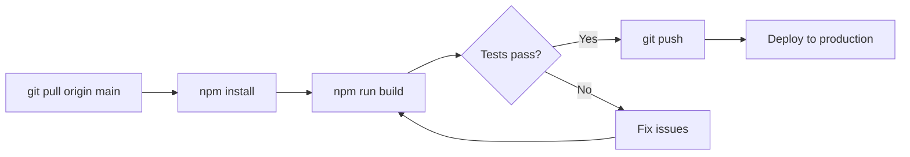
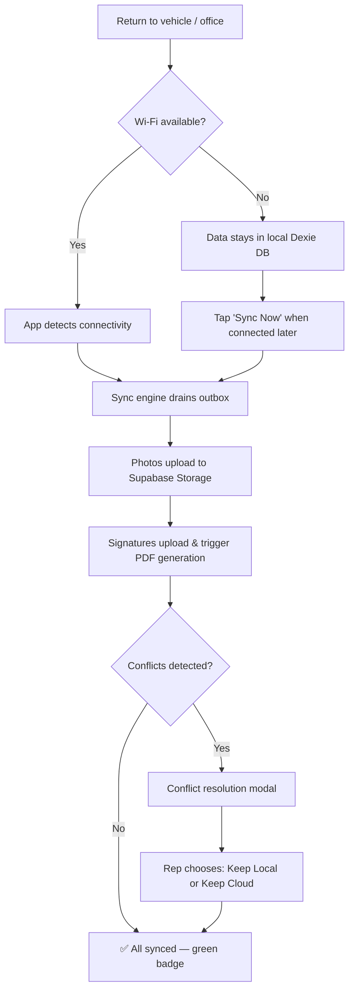
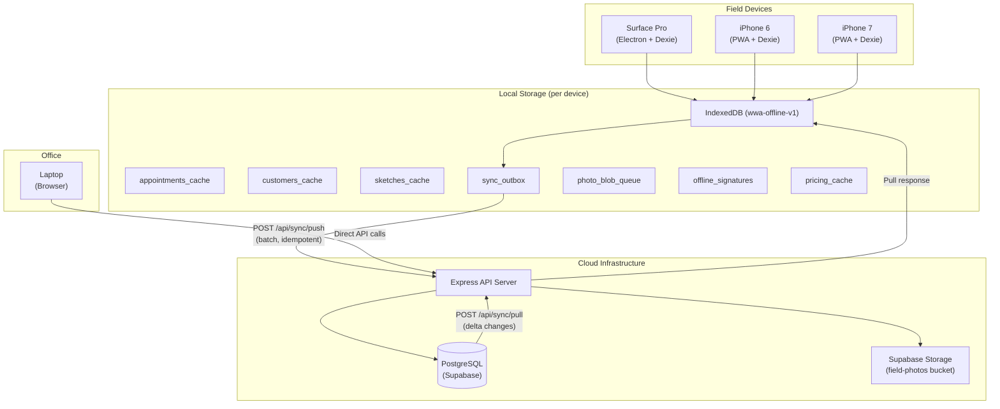
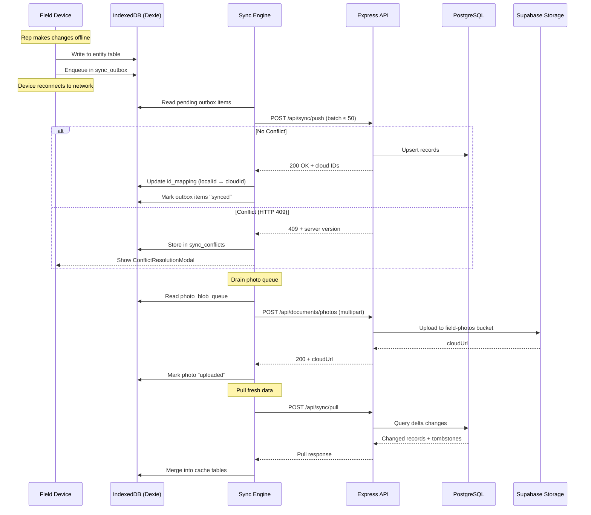
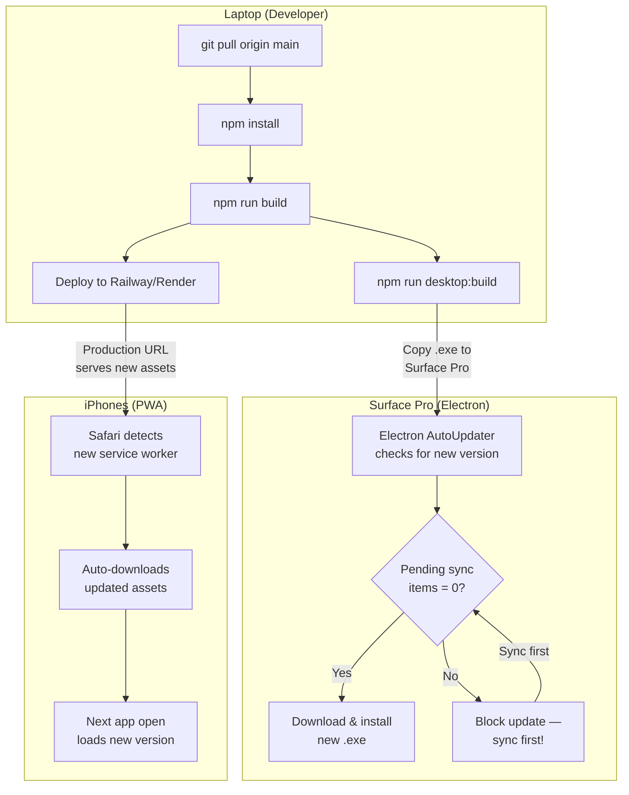

# 🖥️📱 Four-Device Workflow — Window World Assistant

> **Scope:** This document describes how Window World Assistant is used across all four field devices, from development through daily sales appointments.

---

## 1. Device Overview

| # | Device | Screen Size | Primary Use | Connection Type | App Platform | Local Storage |
|---|--------|-------------|-------------|-----------------|--------------|---------------|
| 1 | **Current Computer (Laptop)** | 15.6″+ | Development, builds, deployment, data review | Always-on Wi-Fi / Ethernet | Browser (`localhost`) or production URL | Git repo + Node.js dev server |
| 2 | **Surface Pro (12-inch)** | 12.3″ (2736×1824) | Full field workflow — sketch, measure, quote, sign | Wi-Fi at office; offline in field | Electron desktop app (Chromium shell) | `%APPDATA%\WindowWorldAssistant\` · IndexedDB via Dexie (`wwa-offline-v1`) |
| 3 | **iPhone 6** | 4.7″ (375×667) | Quick photo capture, appointment lookup, basic data entry | Cellular / Wi-Fi | PWA via Safari (Add to Home Screen) | IndexedDB via Dexie (`wwa-offline-v1`) |
| 4 | **iPhone 7** | 4.7″ (375×667) | Quick photo capture, measurement entry, notes | Cellular / Wi-Fi | PWA via Safari (Add to Home Screen) | IndexedDB via Dexie (`wwa-offline-v1`) |

> [!NOTE]
> The Surface Pro is the **primary field device** and runs the complete 10-step appointment workflow. The iPhones serve as lightweight companions for photo capture, quick data entry, and appointment lookup.

---

## 2. Workflow: Before the Appointment

### 2.1 Laptop — Build, Test & Deploy



**Steps:**

1. **Pull latest code**
   ```powershell
   cd c:\dev\github\business\WindowWorldAssistant
   git pull origin main
   npm install
   ```

2. **Build & verify**
   ```powershell
   # Build web app
   npm run build --workspace=apps/web

   # Build server
   npm run build --workspace=server

   # Run type checks
   npm run typecheck --workspace=apps/web
   npm run typecheck --workspace=server

   # Lint
   npm run lint --workspace=apps/web
   ```

3. **Test locally** (optional)
   ```powershell
   # Start dev server
   npm run dev
   # → Frontend: http://localhost:5173
   # → Backend:  http://localhost:3001
   ```

4. **Deploy** — Push to GitHub; Railway/Render auto-deploys from `main`, or manually deploy via:
   ```powershell
   # Verify production bundle locally
   $env:NODE_ENV = "production"
   $env:PORT = "8080"
   node server/dist/index.js
   ```

5. **Build Surface Pro installer** (when desktop updates are needed)
   ```powershell
   npm run desktop:build
   # Output: apps/desktop/release/Window World Assistant Setup X.X.X.exe
   ```

### 2.2 Surface Pro — Sync & Prepare

1. **Connect to office Wi-Fi** before leaving for appointments.
2. **Open the app** — launch "WWA Field" from the Start menu.
3. **Wait for cache warming** — the dashboard auto-fetches today's appointments, customers, openings, pricing tables, and sketch data into the local Dexie database.
4. **Verify the green "Offline Ready" badge** appears in the header.
5. **Check pending sync** — ensure the `SyncStatusBar` shows **0 pending items**. If items remain, tap **"Sync Now"** and wait for completion.

> [!IMPORTANT]
> **Never leave the office until the green "Offline Ready" badge is visible.** If you leave while the cache is still warming, the app may show a blank screen when you go offline.

### 2.3 iPhones (iPhone 6 & iPhone 7) — Verify PWA

1. **Open the PWA** from the Home Screen (or install it: Safari → Share → Add to Home Screen).
2. **Log in** if not already authenticated.
3. **Verify today's appointments** appear on the `MobileHomePage`.
4. **Check the offline indicator** — the header should show sync status.

> [!TIP]
> Perform steps 2.3 while still on office Wi-Fi to ensure all appointment data and pricing tables are cached locally before heading into the field.

---

## 3. Workflow: During the Appointment

### 3.1 Surface Pro — Full Field Workflow

The Surface Pro runs the complete 10-step workflow at the customer's home:

```
Step 0: Customer        → Verify/update customer name, phone, address
Step 1: Project         → Confirm job address, project type, notes
Step 2: Sketch          → Draw house outline with Surface Pen, place window markers
Step 3: Openings        → Per-opening measurements, product selection, options
Step 4: Pricing         → Review pricing, finance options, recalculate
Step 5: Proposal        → Generate customer proposal
Step 6: Order Review    → Sketch-to-order preview + order form
Step 7: Sign & Contract → Customer signing, warranty, contract PDF
Step 8: Validation      → MissingInfoCheck, blocker/warning scan
Step 9: Submit          → Final export, signature gate, document checklist
```

**Key Surface Pro capabilities during the appointment:**

| Task | How | Offline? |
|------|-----|----------|
| **Sketch house outline** | Surface Pen on `DrawableSketch` canvas | ✅ Yes |
| **Place window markers** | Tap or pen-tap on sketch canvas | ✅ Yes |
| **Duplicate windows** | Double-tap pen barrel button | ✅ Yes |
| **Erase strokes** | Flip pen to eraser end | ✅ Yes |
| **Enter measurements** | Measurement keypad or Bosch GLM165 Bluetooth laser | ✅ Yes |
| **Capture photos** | Camera or file picker → stored in `photo_blob_queue` | ✅ Yes (queued) |
| **Select products/options** | Opening editor or 8-step Opening Wizard | ✅ Yes |
| **Review pricing** | Uses cached `pricing_cache` (TTL: 24h) | ✅ Yes (draft) |
| **Capture signature** | Touch/pen signature pad → stored in `offline_signatures` | ✅ Yes (pending) |
| **Generate Excel order form** | Electron IPC → local `excelGenerator.ts` | ✅ Yes |
| **Generate PDF proposal** | Requires server | ❌ Queued |
| **Voice AI dictation** | Requires server | ❌ Unavailable |
| **Satellite map view** | Requires Mapbox tiles | ❌ "Map unavailable offline" |

### 3.2 iPhones — Quick Capture & Data Entry

The iPhones use the mobile-optimized interface (`/mobile/field/:id`) with a 12-button action grid:

| Task | How | Offline? |
|------|-----|----------|
| **Capture photos** | Camera modal → 8 photo types → stored in `photoQueue` | ✅ Yes (queued) |
| **Quick measurement entry** | Measurement keypad with fraction parsing | ✅ Yes |
| **Add text notes** | Notes panel → saved to `mobileStore` | ✅ Yes |
| **Voice recording** | Browser `SpeechRecognition` API (local) | ✅ Partial |
| **View appointment details** | Cached appointment data | ✅ Yes |
| **Sketch (finger drawing)** | Touch-based sketch canvas | ✅ Yes |
| **Add/edit openings** | Opening Wizard (8-step) | ✅ Yes |
| **View pricing** | Cached pricing data | ✅ Yes (draft) |
| **Export/share** | Export menu with native Share API | ❌ Requires connection |

> [!TIP]
> The iPhones are best used as **photo capture companions** while the Surface Pro handles the primary workflow. A common pattern: the rep uses the iPhone to photograph each window from outside while simultaneously sketching the house outline on the Surface Pro inside.

---

## 4. Workflow: After the Appointment

### 4.1 Surface Pro — Sync Back



1. **Reconnect to Wi-Fi** (office, home, or hotspot).
2. The sync engine **automatically detects connectivity** and begins draining the `sync_outbox`.
3. **Photos** upload from `photo_blob_queue` to Supabase Storage (deduplicated by SHA-256 hash).
4. **Offline signatures** upload and trigger server-side PDF contract generation.
5. **Conflicts** (if another user edited the same record) trigger the `ConflictResolutionModal`.
6. **Verify** the `SyncStatusBar` shows **"Synced" (green)** with 0 pending items.

> [!WARNING]
> **Never install an app update while there are pending sync items.** Always ensure the SyncStatusBar shows 0 pending items before updating the Electron app.

### 4.2 iPhones — Auto-Sync

1. iPhones auto-sync via the `useSyncWorker` queue when cellular or Wi-Fi is available.
2. The `SyncStatusBar` in the header transitions: **Pending → Syncing → Synced**.
3. Photos upload from the `photoQueue` in the background.
4. Failed items retry automatically with exponential backoff.

### 4.3 Laptop — Review Synced Data

1. **Open the production app** in a browser or run the local dev server.
2. Navigate to the **Dashboard** or **Office Queue** (`/office`) to review completed appointments.
3. **Verify** all field data (measurements, photos, sketches, signatures) synced correctly.
4. **Generate final documents** (PDF proposals, contracts) if not already generated.
5. **Review conflicts** that may require admin resolution.

---

## 5. Data Sync Flow

### 5.1 Architecture Diagram



### 5.2 Sync Engine Detail



### 5.3 Sync API Endpoints

| Endpoint | Method | Purpose |
|----------|--------|---------|
| `/api/sync/push` | POST | Push outbox batch (up to 50 items, idempotent) |
| `/api/sync/pull` | POST | Pull delta changes (customers, appointments, openings, sketches, tombstones) |
| `/api/sync/register-device` | POST | Register a new device for sync |
| `/api/sync/resolve-conflict` | POST | Resolve a sync conflict (keep local or keep cloud) |
| `/api/sync/status` | GET | Check sync health and pending counts |
| `/api/sync/cleanup-idempotency` | POST | Admin-only: clean up expired idempotency keys |

---

## 6. Offline Capabilities

### 6.1 Per-Device Offline Matrix

| Feature | Laptop | Surface Pro | iPhone 6 | iPhone 7 |
|---------|--------|-------------|----------|----------|
| View appointments | N/A (always online) | ✅ Cached | ✅ Cached | ✅ Cached |
| Create/edit openings | N/A | ✅ Draft → outbox | ✅ Draft → outbox | ✅ Draft → outbox |
| Sketch (draw house outline) | N/A | ✅ Pen + autosave | ✅ Finger + autosave | ✅ Finger + autosave |
| Place window markers | N/A | ✅ Local | ✅ Local | ✅ Local |
| Enter measurements | N/A | ✅ Keypad + Bluetooth | ✅ Keypad only | ✅ Keypad only |
| Capture photos | N/A | ✅ Blob queue | ✅ Blob queue | ✅ Blob queue |
| Voice notes (local recording) | N/A | ✅ Browser API | ✅ Browser API | ✅ Browser API |
| Text notes | N/A | ✅ mobileStore | ✅ mobileStore | ✅ mobileStore |
| Pricing / quoting | N/A | ✅ Cached (marked DRAFT) | ✅ Cached (marked DRAFT) | ✅ Cached (marked DRAFT) |
| Capture signature | N/A | ✅ Offline signatures | ✅ Offline signatures | ✅ Offline signatures |
| Generate Excel order | N/A | ✅ Local (Electron IPC) | ❌ Not available | ❌ Not available |
| Generate PDF proposal | ❌ Server only | ❌ Queued until online | ❌ Queued until online | ❌ Queued until online |
| Voice AI parsing | ❌ Server only | ❌ Requires connection | ❌ Requires connection | ❌ Requires connection |
| Mapbox satellite view | ❌ Server only | ❌ "Map unavailable" | ❌ "Map unavailable" | ❌ "Map unavailable" |

### 6.2 Offline Storage Structure (Dexie `wwa-offline-v1`)

| Table | Purpose | TTL |
|-------|---------|-----|
| `appointments_cache` | Full appointment snapshots | Refreshed on each sync pull |
| `customers_cache` | Customer records | Refreshed on each sync pull |
| `sketches_cache` | House map + markers | Refreshed on each sync pull |
| `sync_outbox` | Pending changes queue (idempotent) | Drained on reconnect |
| `sync_conflicts` | Server-detected conflicts | Until resolved |
| `offline_signatures` | Captured signatures (binary) | Until uploaded |
| `photo_blob_queue` | Photo blobs (binary, not base64) | Until uploaded |
| `pricing_cache` | Pricing tables + rules | 24 hours |
| `field_manual_cache` | Field manual + training text | 7 days |
| `id_mapping` | localId → cloudId mappings | Permanent |
| `device_meta` | Device state + offline-ready flag | Permanent |
| `local_db_migrations` | Schema version tracking | Permanent |

### 6.3 Offline-Ready Status Indicators

| Indicator | Meaning |
|-----------|---------|
| 🔴 **Not Ready** | No offline cache — must be online to view appointments |
| 🟡 **Syncing...** | Cache warming in progress — do not leave Wi-Fi |
| 🟢 **Offline Ready** | All field data cached — safe to go offline |
| 🟠 **Offline Ready\*** | Cached but pricing data may be stale (>24h old) |
| ❌ **Sync Failed** | Cache warming failed — check internet connection |

---

## 7. Update Process

### 7.1 How Each Device Gets Updated



### 7.2 Update Details Per Device

| Device | Update Method | Trigger | Safety Check |
|--------|---------------|---------|--------------|
| **Laptop** | `git pull` + `npm install` + `npm run build` | Manual (developer-initiated) | Run `npm run typecheck` and `npm run lint` before deploying |
| **Surface Pro** | Electron AutoUpdater or manual `.exe` install | AutoUpdater checks on app launch; manual = copy new installer | ⚠️ **Blocked if `sync_outbox` has pending items** — must sync first |
| **iPhone 6** | PWA auto-update via service worker | Safari checks for new service worker on each visit | Transparent — old cache replaced with new assets |
| **iPhone 7** | PWA auto-update via service worker | Same as iPhone 6 | Transparent — old cache replaced with new assets |

### 7.3 Surface Pro Update Procedure (Safe)

> [!CAUTION]
> **Never update the Surface Pro app while there are unsynced changes.** The installer replaces app binaries. Although it preserves the `%APPDATA%` local database, updating during a pending sync risks data corruption.

1. **Connect to Wi-Fi** and open the app.
2. **Tap "Sync Now"** and wait for the `SyncStatusBar` to show **"Synced" (green)** with 0 pending items.
3. **Close the app** completely.
4. **Run the new installer** (`Window World Assistant Setup X.X.X.exe`).
5. **Relaunch** the app and verify the cache warms successfully.

### 7.4 iPhone PWA Force-Refresh

If the PWA doesn't pick up the latest version:

1. Open the production URL directly in Safari (not from Home Screen).
2. Navigate to `https://wwassistant.bridgebox.ai/update` — this unregisters service workers and clears the PWA cache.
3. Close all Safari tabs.
4. Re-open the app from the Home Screen.
5. Log in again and allow cache to warm.

---

## 8. Troubleshooting

### 8.1 Surface Pro Issues

| Problem | Cause | Solution |
|---------|-------|----------|
| **Blank screen when offline** | Left office before cache warming completed | Reconnect to Wi-Fi, wait for 🟢 "Offline Ready" badge, then disconnect |
| **Bluetooth laser won't connect** | Windows Bluetooth disabled or Bosch laser not in pairing mode | Enable Bluetooth in Windows system tray; ensure Bosch GLM165 is flashing blue |
| **Pen eraser not working** | Pen shortcuts disabled in settings | Open Sketch canvas → ⚙️ Pen Settings → enable "Hardware Eraser" |
| **Pen barrel duplicate not working** | Feature toggled off or non-pen pointer type | Open Sketch canvas → ⚙️ Pen Settings → enable "Barrel Button Duplicate" |
| **Sync stuck / items won't upload** | Network interruption or server error | Open DevTools (`Ctrl+Shift+I`) → Console → check outbox. Tap "Sync Now" to retry. Use `Ctrl+F12` Root Cause panel for advanced diagnostics |
| **Pricing shows "stale" warning** | Pricing cache older than 24 hours | Reconnect to Wi-Fi and let the app refresh the `pricing_cache` |
| **"Pending Sync" won't clear** | Failed idempotency or server-side error | Open DevTools Console and run: `await db.sync_outbox.where('status').equals('failed').modify({ status: 'pending', retryCount: 0, lastError: null })` |
| **Lost local data** | User clicked "Clear Site Data" or "Reset App" with unsynced changes | ⚠️ **Unrecoverable.** Always sync before clearing data. Restore from last server-side backup if available |

### 8.2 iPhone Issues (Both iPhone 6 & iPhone 7)

| Problem | Cause | Solution |
|---------|-------|----------|
| **PWA won't install** | Not using Safari, or site not served over HTTPS | Must use Safari for iOS PWA install. Verify the production URL uses HTTPS |
| **App shows old version** | Service worker serving stale cache | Visit `/update` in Safari to clear service workers, then re-open from Home Screen |
| **Photos not syncing** | Poor cellular signal or photo queue stuck | Connect to Wi-Fi and force-sync. Check that photos are ≤10MB each |
| **Blank screen on launch** | Cache wasn't warmed before going offline | Reconnect to internet, open app in Safari, wait for data to load, then use from Home Screen |
| **Keyboard covers input fields** | iOS Safari viewport behavior on small screens | Scroll down or tap outside the input field, then tap back in. The app uses `viewport-fit=cover` |
| **App crashes / freezes** | iPhone 6 memory limitations (1GB RAM) | Close other apps. Avoid having many photos queued simultaneously. Restart the app |
| **Login session expired** | JWT token expired while offline | Reconnect to internet and log in again. Cached data should persist through re-authentication |

### 8.3 Laptop Issues

| Problem | Cause | Solution |
|---------|-------|----------|
| **Build fails** | Missing dependencies or TypeScript errors | Run `npm install` then `npm run typecheck --workspace=apps/web` to identify errors |
| **Dev server won't start** | Port conflict or missing `.env` | Check that ports 5173 and 3001 are free. Verify `server/.env` and `apps/web/.env` exist with required variables |
| **Database connection fails** | Invalid `DATABASE_URL` or Supabase outage | Verify `.env` connection strings. Check Supabase dashboard status |
| **Desktop build fails** | Electron builder dependencies missing | Run `npm install` in `apps/desktop/`. On Windows, ensure `windows-build-tools` is installed |
| **Synced data doesn't appear** | Browser cache showing stale data | Hard refresh (`Ctrl+Shift+R`) or clear browser cache |

### 8.4 General Sync Issues

| Problem | Cause | Solution |
|---------|-------|----------|
| **Conflict resolution modal appears** | Another user (e.g., office admin) edited the same record while the field device was offline | Choose "Keep Local" (your field data) or "Keep Cloud" (office data). Decision is logged in `AuditLog` |
| **Duplicate records after sync** | Idempotency key expired or was cleaned up | Admin: check `SyncIdempotencyKey` table. Manually deduplicate if needed |
| **Photos uploaded but not visible** | Supabase Storage bucket permissions | Admin: verify `field-photos` bucket exists and RLS policies are correct |

### 8.5 Emergency: Root Cause Diagnostics (Surface Pro)

For advanced troubleshooting on the Surface Pro, press `Ctrl+F12` to open the **Root Cause Panel**:

| Action | What It Does |
|--------|-------------|
| **Force Sync Retry** | Resets all `failed` outbox items to `pending` and triggers immediate sync |
| **Rebuild Local Cache Index** | Re-indexes the Dexie database without losing data |
| **Export Raw Local DB** | Exports the entire local database as JSON for support analysis |
| **Backup Local Data** | Creates a full backup of all cached data to a local file |

---

## 9. Quick Reference: Daily Checklist

### ☀️ Morning (At the Office)

- [ ] **Laptop:** `git pull` → build → deploy if there are changes
- [ ] **Surface Pro:** Open app on Wi-Fi → verify 🟢 "Offline Ready" → 0 pending sync items
- [ ] **iPhone 6:** Open PWA on Wi-Fi → verify appointments are loaded
- [ ] **iPhone 7:** Open PWA on Wi-Fi → verify appointments are loaded

### 🏠 At the Customer's Home

- [ ] **Surface Pro:** Run full 10-step workflow (sketch → measure → quote → sign)
- [ ] **iPhone (either):** Capture exterior photos, quick measurements if needed

### 🌙 Evening (Back Online)

- [ ] **Surface Pro:** Connect to Wi-Fi → verify auto-sync completes → 0 pending items
- [ ] **iPhone 6:** Verify auto-sync completed (check SyncStatusBar)
- [ ] **iPhone 7:** Verify auto-sync completed (check SyncStatusBar)
- [ ] **Laptop:** Review synced data in Office Queue → generate final PDFs

---

## 10. File Reference

| Purpose | File |
|---------|------|
| Offline database schema | [`offlineDb.ts`](file:///c:/dev/github/business/WindowWorldAssistant/apps/web/src/lib/offlineDb.ts) |
| Sync engine | [`syncEngine.ts`](file:///c:/dev/github/business/WindowWorldAssistant/apps/web/src/lib/syncEngine.ts) |
| Cache warmer | [`cacheWarmer.ts`](file:///c:/dev/github/business/WindowWorldAssistant/apps/web/src/lib/cacheWarmer.ts) |
| Mobile store (offline state) | [`mobileStore.ts`](file:///c:/dev/github/business/WindowWorldAssistant/apps/web/src/store/mobileStore.ts) |
| Surface Pen input handler | [`surfacePenInput.ts`](file:///c:/dev/github/business/WindowWorldAssistant/apps/web/src/utils/surfacePenInput.ts) |
| Mobile field page | [`MobileFieldPage.tsx`](file:///c:/dev/github/business/WindowWorldAssistant/apps/web/src/pages/MobileFieldPage.tsx) |
| Mobile home page | [`MobileHomePage.tsx`](file:///c:/dev/github/business/WindowWorldAssistant/apps/web/src/pages/MobileHomePage.tsx) |
| Sketch canvas | [`DrawableSketch.tsx`](file:///c:/dev/github/business/WindowWorldAssistant/apps/web/src/components/DrawableSketch.tsx) |
| Desktop Electron entry | [`apps/desktop/`](file:///c:/dev/github/business/WindowWorldAssistant/apps/desktop/) |
| Excel generator (Electron) | [`excelGenerator.ts`](file:///c:/dev/github/business/WindowWorldAssistant/apps/desktop/src/excelGenerator.ts) |
| Architecture lock | [ARCHITECTURE.md](file:///c:/dev/github/business/WindowWorldAssistant/ARCHITECTURE.md) |
| Offline deployment guide | [OFFLINE_DEPLOYMENT.md](file:///c:/dev/github/business/WindowWorldAssistant/OFFLINE_DEPLOYMENT.md) |
| Surface Pro install guide | [SURFACE_PRO_OFFLINE_INSTALL.md](file:///c:/dev/github/business/WindowWorldAssistant/docs/SURFACE_PRO_OFFLINE_INSTALL.md) |
| Surface Pro pen controls | [SURFACE_PRO_PEN_CONTROLS.md](file:///c:/dev/github/business/WindowWorldAssistant/docs/SURFACE_PRO_PEN_CONTROLS.md) |
| Deployment options | [DEPLOYMENT.md](file:///c:/dev/github/business/WindowWorldAssistant/docs/DEPLOYMENT.md) |
