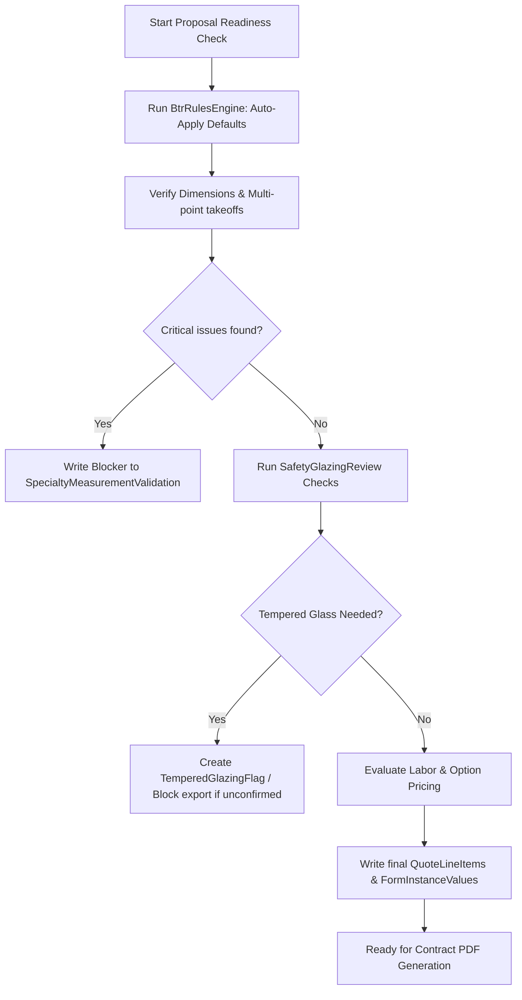

# 2026 BTR Pricing Guidelines Rule Mapping

This document lists the business, installation, safety, and pricing rules from the 2026 BTR Pricing Guidelines and details how they map to database models and rule-processing services.

---

## 1. Core Rule Mappings

| Rule Code | Description / Target | Trigger Condition | Target DB Model / Column | Processing Class / Service |
| :--- | :--- | :--- | :--- | :--- |
| **BTR-01** | Default Glass Option | Default all new window openings to Low-E Elite (`LEE`) | `Opening.glassPackage = 'LEE'` | `btrRulesEngine.ts` |
| **BTR-02** | Default Foam Wrap | Default all new openings to have foam wrap insulation wrap | `Opening.foamEnhanced = true` | `btrRulesEngine.ts` |
| **BTR-03** | Default Removal Type | Default all window replacements to aluminum removal (`ALUM`) | `Opening.removalType = 'ALUM'` | `btrRulesEngine.ts` |
| **BTR-04** | Brick Exterior Installation| If opening exterior touches brick, default installation to outside (`EXT`) | `Opening.installType = 'EXT'` | `installMethodAdvisor.service.ts` |
| **BTR-05** | Wood/Siding Trim Warning | If exterior touches wood or siding, warn that inside installation + trim is required | `AiValidationWarning` / `Opening.trimType` | `btrRulesEngine.ts` |
| **BTR-06** | Picture Window Screen | Picture windows (`MODEL 3004`) must not have screens default | `Opening.screenOption = 'none'` | `btrRulesEngine.ts` |
| **BTR-07** | Oriel Sash Confirmation | If Oriel window is checked, block export until top sash height is recorded | `Opening.orielConfirmed = false` (blocks) | `btrRulesEngine.ts` |
| **BTR-08** | Clear Story Surcharge | If floor level > 1, apply clear story labor charge ($225 1st, $75 addl.) | `QuoteLineItem` (category: 'labor') | `pricingEngine.ts` / `pricingService.ts` |
| **BTR-09** | Tempered Glazing Check | Triggers warning if window is near doors or wet areas (louisiana code) | `OpeningSafetyGlazingReview` / `TemperedGlazingFlag` | `safetyGlazing` service / `validation.ts` |
| **BTR-10** | Specialty Shape Dims | If shape type is arch/eyebrow, block export if leg height is missing | `SpecialtyMeasurementValidation` (blocks) | `measurementRules.routes.ts` |

---

## 2. DB Models Involved in Rule Logging

* **`BusinessRuleExecutionLog`**: Logs all automatically applied rule outcomes (e.g. defaulting glass package to `LEE` or setting `foamEnhanced = true`).
* **`AiValidationWarning`**: Stores warnings for reps about potential structural/exterior conditions (e.g., matching a paint surcharge when exterior is custom color, or noting siding trim requirements).
* **`OpeningSafetyGlazingReview` & `TemperedGlazingFlag`**: Tracks safety glazing requirements (e.g., checking if the window pane is within 24 inches of a door or in a bathroom).
* **`SpecialtyMeasurementValidation`**: Tracks structural completeness checks for non-standard window profiles.

---

## 3. Execution & Validation Flow

During the proposal readiness check, the system evaluates all rules in sequence:

---

*Document updated: 2026-06-10*  
*Author: Antigravity*
